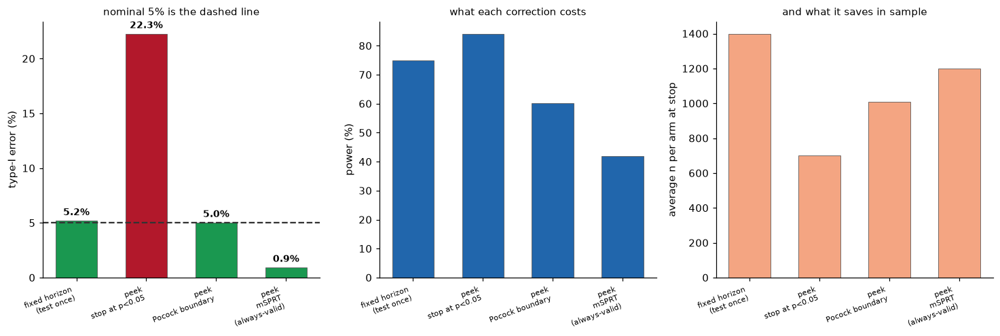
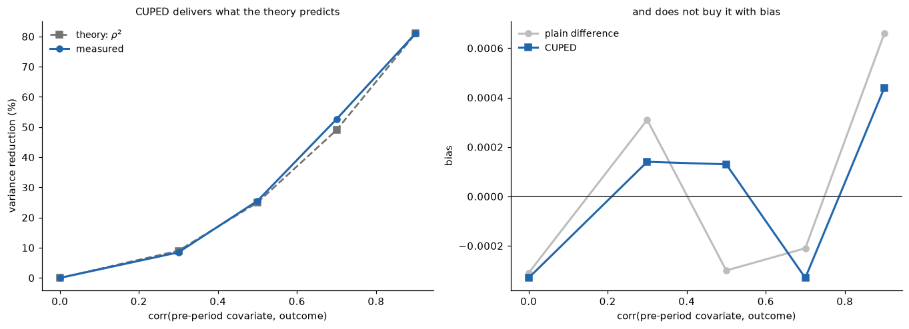
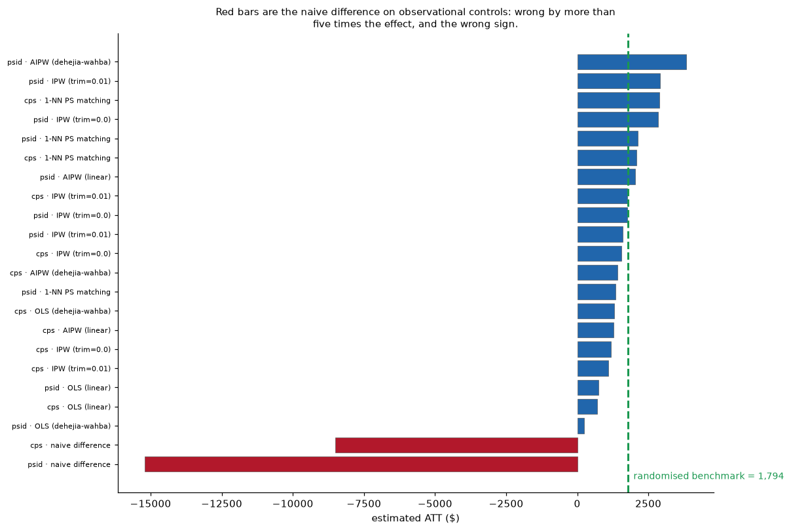
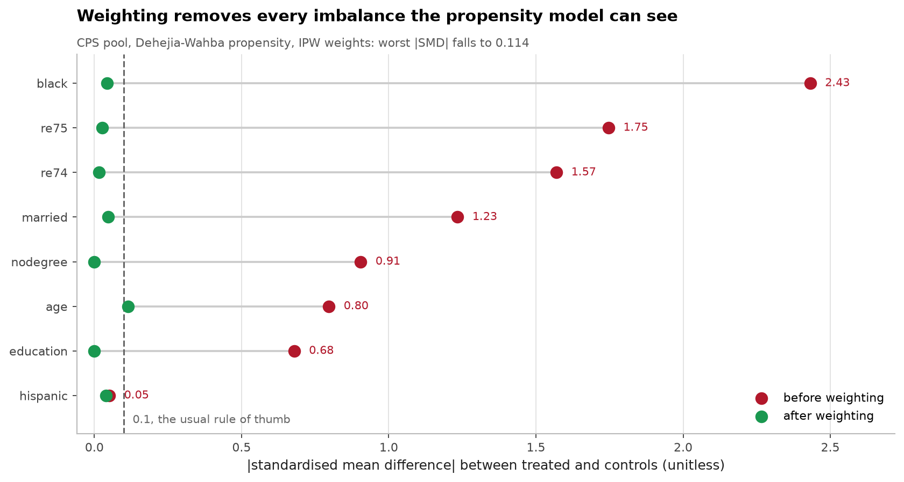
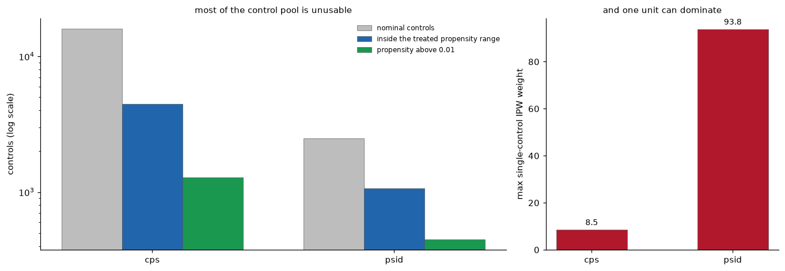

# A/B testing and causal inference, checking the methods against known answers

**[▶ Live demo](https://ab-causal.streamlit.app/)** · analyse a live test with a
threshold that adjusts for how many times you've looked, and an Evidence tab
showing the simulations each rule was scored against.

[](https://github.com/aghasalim/ab-causal/actions/workflows/ci.yml)
[](https://www.python.org/)
[](LICENSE)

Built by a third-year Applied Computer Science (AI) student.

The problem with a causal inference project is that you can't tell whether it
worked. A prediction model can be checked against a held-out label. An estimate
of "what would have happened otherwise" has nothing to check against, because the
otherwise never happened. So the usual portfolio version of this, run a t-test
on a marketing dataset, report a p-value, proves nothing, because it would look
identical if the method were completely wrong.

So this repo only uses situations where **the true answer is known**: simulations
where I set the effect myself, and one famous dataset where a randomised
experiment already told us the answer. Every method gets scored against that
before I'd trust it anywhere else.

---


---

## Abstract

A/B testing and causal inference are both areas where the correct answer is
usually unknown, so methods get adopted on plausibility. This work scores three of
them against known answers.

**Peeking.** Testing daily and stopping at p<0.05 turns a nominal 5% test into a
22.3% one. Both standard corrections restore it, Pocock to 5.0%, mSPRT to 0.9%
and both cost power, dropping from 0.750 to 0.601 and 0.419. Nothing here is free,
and the sample saving is what you are buying with that power.

**CUPED.** Variance reduction tracks the theoretical rho^2 across the correlation
range, and the bias stays at zero, which is the check that the implementation does
what the derivation says.

**LaLonde.** Because the randomised answer is known ($1,794), observational
estimators can be scored rather than argued about. The naive difference on
observational controls returns -$8,498 on CPS and -$15,205 on PSID: wrong by more
than five times the effect, and the wrong sign. Adjustment recovers the ballpark,
but the overlap diagnostics show why it is fragile, PSID keeps 1,068 of 2,490
controls inside the treated propensity range, and a single control can carry an
IPW weight of 93.8.

**Contributions.** (i) Sequential-testing rules scored on type-I error, power and
sample together, so the trade is visible. (ii) A CUPED implementation validated
against its own theory. (iii) LaLonde estimates against the experimental benchmark
with balance and overlap reported as preconditions rather than results.

---

## 1. Three things I measured

### 1. Checking your test daily turns a 5% error rate into 22%
20,000 simulated A/A tests, no real effect at all, looked at once a day for 14 days.

Full detail in [notes/METHODS.md](notes/METHODS.md#1-checking-your-test-daily-turns-a-5-error-rate-into-22).
### 2. CUPED works exactly as advertised, until the covariate is downstream of treatment
Variance reduction tracks the theoretical ρ² closely (`make cuped`): | corr(X, Y) | 0.3 | 0.5 | 0.7 | 0.9 | |---|---|---|---|---| | measured reduction | 0.085 | 0.255 | 0.526 | 0.810 | | predicted (ρ²) | 0.09 | 0.25 | 0.49 | 0.81 | At ρ=0.9 that's 81% less variance, the same precision from roughly five times fewer users, for free, and unbiased throughout.

Full detail in [notes/METHODS.md](notes/METHODS.md#2-cuped-works-exactly-as-advertised-until-the-covariate-is-downstream-of-treatment).
### 3. Every observational method got close to the right answer, and I could only tell because I already knew it
The [LaLonde/NSW](https://users.nber.org/~rdehejia/nswdata.html) job-training programme was randomised, so the honest effect is known: **+$1,794** (SE $671).







Full detail in [notes/METHODS.md](notes/METHODS.md#3-every-observational-method-got-close-to-the-right-answer-and-i-could-only-tell-because-i-already-knew-it).
## 2. Running it

```bash
make setup && make experiments
```

Reproduces every number above. No credentials, no API keys, no paid data, the
simulations are self-contained and LaLonde is public.

```bash
make test
```

12 tests. They assert the *claims*, not just that the code runs: that the fixed-horizon
test really hits 5%, that peeking really inflates it, that the calibrated boundary
really restores control on a seed it wasn't calibrated on, and that CUPED on a
mediator really does erase the effect. If a refactor quietly broke a headline
result, these fail.

```bash
make app
```

An analyser with the checks worth running on a live test: sample-ratio mismatch,
a significance threshold that adjusts for how many times you've looked, and an
MDE calculator for deciding whether an experiment can answer its question before
you run it.

---

## 3. Design notes
**Why simulate first.** Every decision rule is scored on`simulate.py` before it touches real data.`simulate_looks` returns the z-statistic at every interim look and all rules consume that same matrix, so comparisons are paired, naive peeking and the corrected boundary see byte-identical experiments, and differences between them aren't simulation noise.

Full detail in [notes/METHODS.md](notes/METHODS.md#3-design-notes).
## 4. Repository layout

```
src/abcausal/
  simulate.py       simulation harness — truth is known by construction
  sequential.py     fixed-horizon, naive peeking, Pocock, mSPRT
  cuped.py          variance reduction, and how it breaks
  observational.py  OLS, IPW, matching, AIPW, balance and overlap diagnostics
  diagnostics.py    SRM, MDE, required sample size
  experiments/      the three runnable studies above
app/                Streamlit analyser
tests/              12 tests asserting the claims
```

## 5. Licence

MIT, see [LICENSE](LICENSE). LaLonde data is public, courtesy of Rajeev Dehejia
and NBER.
